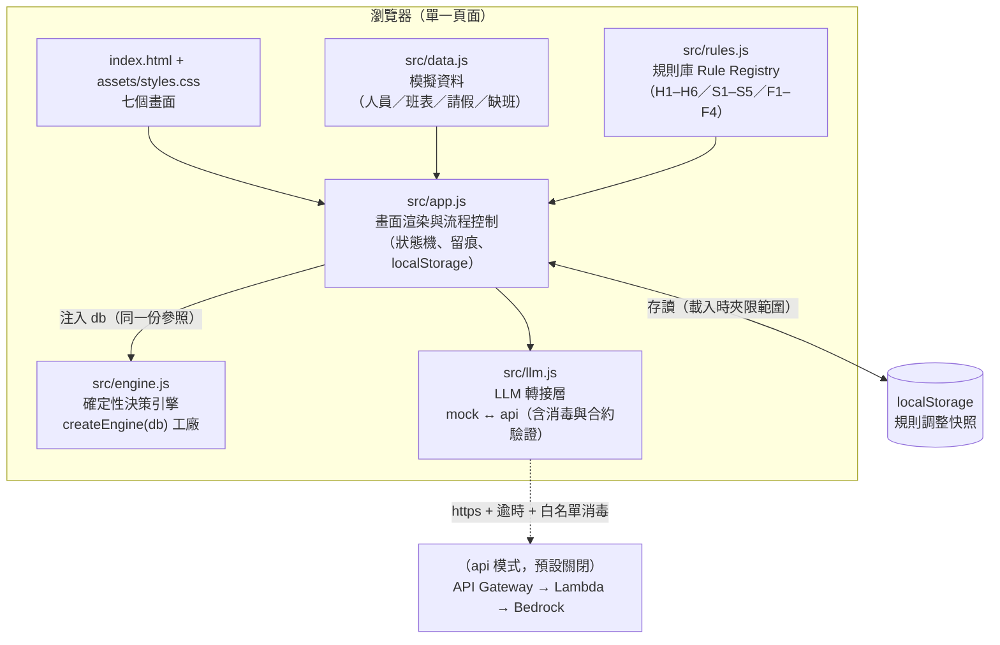
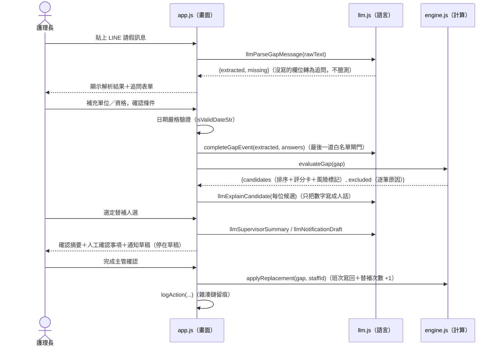
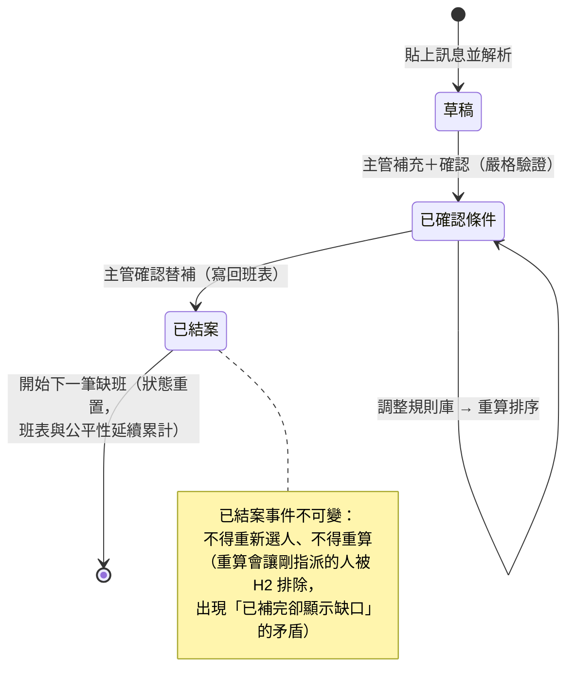
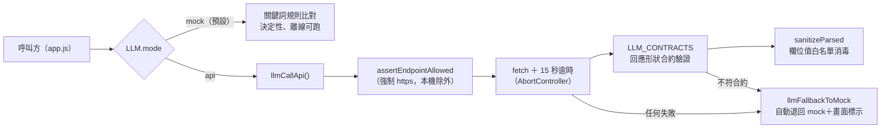
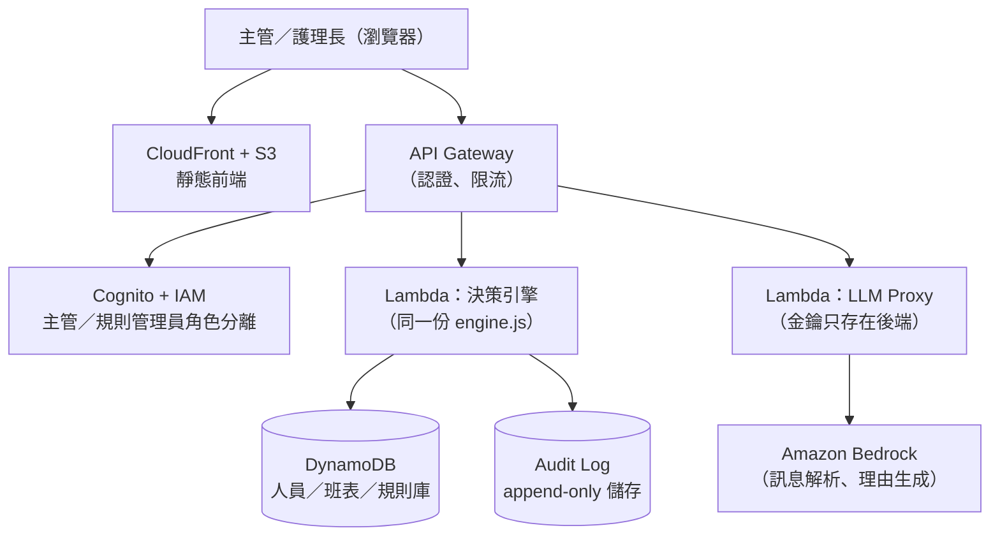

# 班守 ShiftGuard — 系統架構書

> 版本：1.0（2026-08-09）
> 關聯文件：[README.md](../README.md)（快速開始）、[CONTEXT.md](CONTEXT.md)（領域語義權威定義）、
> [proposal.md](proposal.md)（提案素材）、[REVIEW.md](REVIEW.md)（功能與資安審查紀錄）

---

## 1. 系統定位

**醫護排班治理平台，模組一：臨時缺班替補。**
當醫護人員臨時請假，系統在幾秒內給出合格替補候選人、排序理由與風險提示，
且每一個判斷都交代得出依據（規則代碼、法規條文、分數構成）。

### 1.1 系統邊界（明確不做的事）

| 不做 | 原因 |
|---|---|
| 不重排完整月班表 | 範圍控制：只解決「臨時缺班」這一個問題 |
| 不自動通知員工 | 通知一律停在草稿，發送權在主管 |
| 不寫入院內正式班表 | 本平台是決策輔助，不是排班系統的替代品 |
| 不自行放寬規則、不補完缺漏欄位 | Agent 治理原則：確定性歸程式、決定權歸人 |
| 不使用病患資料與真實姓名 | 人員一律代號化（N-01 ~ N-11），資料全數虛構 |

## 2. 核心設計原則

### 2.1 確定性歸程式、語言歸模型

| 職責 | 負責模組 | 內容 |
|---|---|---|
| **算得準** | `src/engine.js`（確定性規則引擎） | 工時累計、班間休息、連續天數、證照效期、加權評分、指派最佳化 |
| **說得清** | `src/llm.js`（語言模型轉接層） | 解析請假訊息、追問缺漏、把數字寫成人話、生成摘要與草稿 |

算錯工時在醫療場域是**合規事故**，不是體驗瑕疵；語言模型會產生流暢但錯誤的數字，
所以所有數字一律來自引擎，模型不得改寫、不得自行計算、不得補完缺漏欄位。

### 2.2 人在迴路（Human-in-the-loop）

Agent 的每一個關鍵動作都停在「建議」：追問而非臆測、試算放寬而非自行放寬、
草稿而非發送、主管確認後才寫回。決策留痕記錄每一步是誰做的。

## 3. 系統架構總覽

### 3.1 現況：純前端零依賴架構

整個平台是靜態網頁（HTML + 原生 JS，無框架、無打包、無外部資源），
可雙擊 `index.html` 離線執行，或由 GitHub Pages 託管。



### 3.2 模組職責

| 檔案 | 職責 | 關鍵設計 |
|---|---|---|
| `index.html` | 七個畫面的骨架 | 無 inline script；CSP 限制同源資源 |
| `src/data.js` | 模擬資料層 | 全虛構、代號化；正式導入時整層替換為 API 讀取 |
| `src/rules.js` | 規則庫 | 規則是**可維護的資料**，不是寫死的程式碼 |
| `src/engine.js` | 決策引擎 | `createEngine(db)` 依賴注入，零全域讀取，可移植至 Lambda |
| `src/llm.js` | LLM 轉接層 | mock／api 雙模式；api 回應經合約驗證＋白名單消毒 |
| `src/app.js` | 畫面與流程 | 唯一操作 DOM 的模組；輸出一律經 `esc()` 跳脫 |
| `tests/engine.test.js` | 邊界測試 | 瀏覽器（tests.html）與 CI（Node）共用同一份 |
| `tests/run-node.js` | CI runner | 把 module.exports 掛回 globalThis，模擬瀏覽器載入順序 |

**依賴方向**：`app.js → (engine, llm, data, rules)`；`engine.js` 不依賴任何模組（資料全部注入）；
`llm.js` 依賴 `data.js` 的常數表（SHIFT_TYPES 等）做關鍵詞比對與白名單驗證。

## 4. 資料流：一筆缺班事件的完整旅程



## 5. 缺班事件生命週期



## 6. 決策引擎內部設計

### 6.1 三層規則模型

```
評估一位人員 = 硬性約束（過濾）→ 軟性偏好（排序）→ 風險標記（知情）
```

| 層 | 代碼 | 行為 | 例 |
|---|---|---|---|
| 硬性約束 | H1–H6 | 違反即排除，附規則代碼與原因 | H4 班間休息 ≥ 11h（勞基法 §34） |
| 軟性偏好 | S1–S5 | 加權評分（權重總和 100），決定排序 | S1 公平性 30 分（治理核心訊號） |
| 風險標記 | F1–F4 | 不排除，但主管必須知情；F1 需額外核准 | F3 跨單位支援需加強交班 |

各規則的完整定義、法規依據與可否放寬，見 `src/rules.js` 與 [CONTEXT.md](CONTEXT.md)。

### 6.2 主要演算法

| 函式 | 用途 | 說明 |
|---|---|---|
| `evaluateGap(gap)` | 單筆缺班評估 | 全員跑硬性檢查 → 合格者評分排序；原班人員一律排除但據實呈現 |
| `relaxationAnalysis(gap)` | 升級路徑試算 | 候選不足時逐條試算「放寬哪條會多出誰」；只試算，不放寬 |
| `assignGreedy(gaps)` | 逐筆貪心（對照組） | 每筆取當下最高分並寫回模擬班表 |
| `assignJointly(gaps)` | 全局指派 | 枚舉全部可行組合，字典序最佳化：先填補筆數、再總分；組合可行性經完整模擬（同一人接多筆的交互檢查） |
| `rosterWarnings()` | 主動預警 | 對已排定班表靜態掃描，high／medium／low 三級 |
| `coverageGaps(dates)` | 配置缺口掃描 | 每單位每班別在班人數 vs 最低配置；無資料單位回報 noData |

規模聲明:demo 為 11 人 × 少量缺班，暴力枚舉即為確定性最佳解;
正式導入若缺班筆數放大，`assignJointly` 應改用整數規劃求解器，目標函數不變。

### 6.3 可移植性

引擎以 `createEngine(db)` 建立，人員／班表／規則皆由外部注入，內部不讀取任何全域資料、
不接觸 DOM。同一份檔案在瀏覽器、tests.html、Node CI 與未來的 Lambda 端點上行為一致——
由 `tests/engine.test.js` 的 22 項邊界測試保證。

## 7. LLM 轉接層設計



四道防線的理由：

1. **合約驗證**（形狀）：模型輸出永遠可能跑格式，畫面不能因此壞掉。
2. **白名單消毒**（值）：通報訊息是不可信輸入，可能夾帶 prompt injection；
   模型吐回的欄位值必須通過白名單（日期真實存在、班別∈SHIFT_TYPES、單位∈UNITS、
   資格⊆CERTS）才能進入引擎與畫面，不合法的值降級為「未解析→追問」。
3. **傳輸安全**：endpoint 強制 https（金鑰與人員資料不得走明文）；15 秒逾時，端點無回應不卡畫面。
4. **失敗退路**：任何一次呼叫失敗立即退回 mock 並標示，演示不中斷。

## 8. 狀態與持久化

| 資料 | 存放 | 生命週期 | 保護 |
|---|---|---|---|
| 規則調整（權重／門檻／啟用） | localStorage | 跨重新整理保存 | 載回時逐值夾限（`PARAM_RANGE`／`WEIGHT_RANGE`），防止被改寫成 0 或負數而無聲關閉法定下限 |
| 班表寫回、替補次數 | 記憶體 | 重新整理即重置 | 刻意設計：方便重複演示 |
| 決策留痕 audit | 記憶體＋可匯出 JSON | 重新整理即重置 | 雜湊鏈結（tamper-evident）：每筆含前筆雜湊，改任一筆即斷鏈；匯出含 `chainValid` |

## 9. 測試與 CI

- `tests/engine.test.js`：釘住合規事故等級的邊界（班間休息恰 11h、連 6／7 天、
  自然週歸屬、大夜跨日、demo 資料集完整結果、解析不臆測、api 失敗退路）。
- 三種執行方式，同一份測試：雙擊 `tests.html`（離線）、`node tests/run-node.js`（本機）、
  GitHub Actions（每次 push 自動跑，`.github/workflows/test.yml`）。
- 語義權威在 [CONTEXT.md](CONTEXT.md)：文件與程式不一致時，以文件為準修程式並補測試。

## 10. 部署架構

### 10.1 現況

| 環境 | 方式 |
|---|---|
| 線上 demo | GitHub Pages（push 即自動更新）https://bobyu89.github.io/nursing-agent/ |
| 離線 demo | 雙擊 `index.html`（CSP 含 `file:` 來源，離線流程不受影響） |
| 本機開發 | `python -m http.server 8777` |

### 10.2 正式導入目標架構（AWS）



關鍵遷移原則：

- **引擎零改寫**：`createEngine(db)` 的資料改由 DynamoDB 注入，計算邏輯與測試不變。
- **金鑰永不落地前端**：Bedrock 呼叫一律經 Lambda proxy；前端只拿短效 token（Cognito）。
- **留痕升級**：前端雜湊鏈保留作為跨系統核對的輕量證據，正式儲存改後端 append-only
  （DynamoDB 條件寫入或 QLDB）。
- **公平性訊號**：`standbyCount30d` 由靜態快照改為「院內實際叫班紀錄的滾動 30 天窗口」。

## 11. 資安設計

### 11.1 前端現況防護（本版已實作）

| 面向 | 機制 |
|---|---|
| XSS | 所有動態輸出經 `esc()` 跳脫（含屬性值）；未來後端資料欄位已預先跳脫 |
| CSP | `default-src 'self'`（含 `file:` 保離線流程）；禁 object；不載入任何第三方資源 |
| 不可信輸入 | 通報訊息（使用者輸入）與 api 模式模型輸出，一律經白名單消毒才進入引擎 |
| 輸入驗證 | 日期嚴格日曆驗證（拒絕 2026-02-31 這類會被 JS Date 無聲進位的值） |
| localStorage | 載回值逐項夾限，防止規則門檻被竄改成無效值 |
| 傳輸 | LLM endpoint 強制 https（本機開發除外）＋ 15 秒逾時 |
| 隱私 | 無 PII（代號化虛構資料）；`referrer no-referrer`；mock 模式訊息內容不離開瀏覽器 |

### 11.2 正式導入必要補強（前端 demo 做不到、也不假裝做到的）

1. **認證與授權**：Cognito ＋ IAM 角色分離（護理長／規則管理員／稽核）；規則調整需權限。
2. **留痕不可竄改**：後端 append-only 儲存；雜湊鏈改用密碼學雜湊（SHA-256）並定期錨定。
3. **API 防護**：限流、WAF、輸入 schema 驗證（API Gateway ＋ Lambda 雙層）。
4. **個資治理**：api 模式會將通報訊息（含病情描述）送往模型端點——需 BAA／資料處理協議、
   去識別化前處理、傳輸與儲存加密、保存期限政策。
5. **稽核與監控**：CloudTrail／CloudWatch；規則變更需雙人核可流程。

## 12. 已知限制

| 限制 | 揭露位置 | 說明 |
|---|---|---|
| mock 解析理解力有限 | README、畫面標示 | 關鍵詞規則，非真實模型推論 |
| `standbyCount30d` 為靜態快照 | CONTEXT.md | 不隨時間滾動過期 |
| 請假粒度為「日」 | CONTEXT.md | 半天假／時段假視為全日不可排班 |
| H5／H6 為簡化的院內政策 | CONTEXT.md | 比法規更嚴；正式導入依變形工時制度重定義 |
| `assignJointly` 指數複雜度 | CONTEXT.md | demo 規模下暴力枚舉即最佳解；放大需求解器 |
| 前端雜湊鏈非密碼學強度 | CONTEXT.md、REVIEW.md | djb2 僅 tamper-evident 展示用 |
