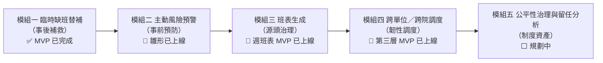
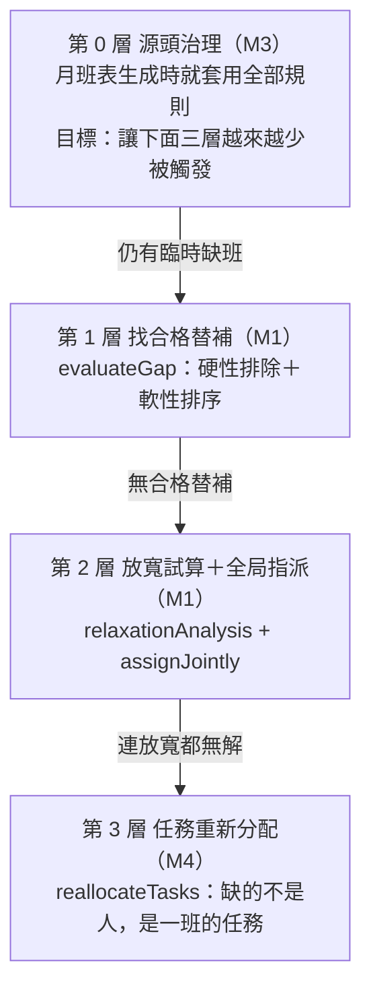
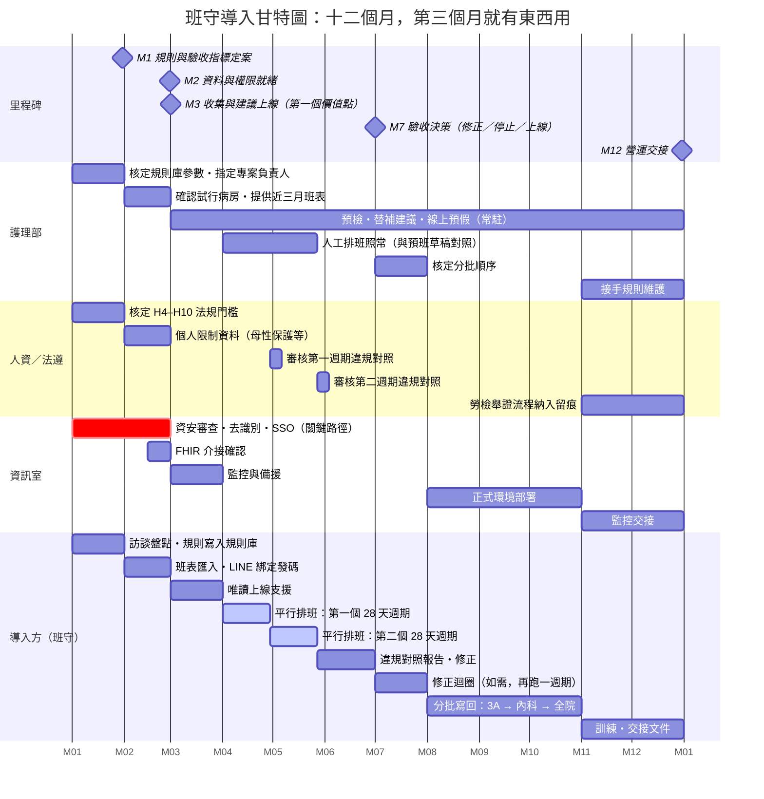
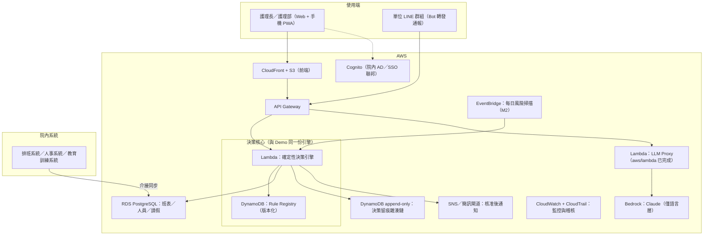

# 班守 ShiftGuard 系統藍圖 v1.0

> **從「缺班替補模組」到「醫護人力韌性作業系統」**
>
> [ARCHITECTURE.md](ARCHITECTURE.md) 講的是現在的系統怎麼蓋；
> 這份文件講的是整個平台要往哪裡去、為什麼現在的樣子是正確的第一步。

---

## 1. 終局視野（North Star）

**班守要成為醫護人力的「治理作業系統」**：讓醫院裡任何一次人力調度——
月班表排定、臨時代班、跨單位支援、災況下的任務重分配——都做到三件事：

| | 意義 | 對應的 kernel |
|---|---|---|
| **算得準** | 工時、班距、資格、負荷，每個數字都是確定性運算 | 決策引擎 |
| **說得清** | 每個決定都攤得開「為什麼是他、為什麼不是他」 | 規則庫 Rule Registry |
| **留得下** | 每一步都可稽核、防竄改，勞檢與評鑑一鍵舉證 | 雜湊鏈留痕 |

一句話定位：**Excel 管的是班表上的格子，班守管的是「為什麼是他」。**

這三個 kernel 從 Demo 第一天就存在（`src/engine.js`、`src/rules.js`、雜湊鏈 audit log），
且在後續每一個階段**都不會被換掉**——被換掉的只有周邊的基礎設施。

## 2. 產品藍圖：五個模組、一條演進軸

平台的演進軸線是**從事後補救走向事前治理，最終到區域韌性**：

| 模組 | 回答的問題 | 現況 |
|---|---|---|
| **M1 臨時缺班替補** | 有人倒了，找誰最合規、最公平？ | ✅ MVP 完成（本 repo 主體） |
| **M2 主動風險預警** | 哪裡快要出事，能不能在請假發生前就看到？ | 🔶 已上線：畫面 4 風險掃描（三級預警）＋首頁**人力缺口總覽**（缺口方程式、合法吸收模擬與代價、結構性缺口判定） |
| **M3 班表生成與最佳化** | 能不能讓班表**排出來的那一刻**就合規又公平？ | 🔶 週班表 MVP 已上線（畫面 8：同一份 H1–H6 生成下週班表＋疊圖重掃雙重驗證＋誠實缺格）；月班表與求解器最佳化為下一步 |
| **M4 跨單位／跨院區調度** | 單位內無解時，人力池能不能放大？ | 🔶 第三層韌性模式 MVP 已上線（任務重分配）；跨單位候選已有 F3 標記 |
| **M5 公平性治理與留任分析** | 長期的分配數據能不能變成留任決策的依據？ | ⬜ 規劃中——公平性儀表板已有雛形，缺時間序列縱深 |

**關鍵設計決定：五個模組不是五個產品，是同一個 kernel 的五個介面。**
規則只在 Rule Registry 定義一次——月班表生成用它、缺班替補用它、
主動預警用它、任務重分配也用它。醫院調一次「班間休息 ≥ 11 小時」，
五個模組同時生效。這是平台與五支獨立工具的分界。

## 3. 決策核心：把三層階梯擴成四層

現在的三層決策階梯（找替補 → 放寬試算＋全局指派 → 任務重分配）之上，
M3 補上的其實是**第 0 層**（週班表版 MVP 已在畫面 8 上線）：

這給了平台一個誠實的**北極星指標**：
**「第三層韌性模式的啟動次數，應該逐季下降。」**
韌性模式被按下的每一次，都代表上游治理還有改善空間——
系統的成功不是自己被用得更多，而是讓最壞情境發生得更少。

## 4. 技術架構演進：四個階段

### 階段總覽

| | Stage 0 ✅ | Stage 1 試點（工程 ✅，待院方試行） | Stage 2 全院 | Stage 3 區域韌性網 |
|---|---|---|---|---|
| **目標** | 證明決策邏輯可信 | 一個病房真實運轉 3–6 個月 | 全院導入、對接院內系統 | 跨院區調度、災難應變 |
| **前端** | 靜態頁（雙擊可跑） | 同左＋以 LINE 身分登入讀寫雲端班表＋預假日曆頁 | S3 + CloudFront | 同左，多租戶 |
| **後端** | 無（純前端） | Cloudflare Worker＋D1（SQLite）＋Cron | API Gateway + Lambda | 同左＋跨院調度服務 |
| **身分** | 示範用視角切換（無登入） | LINE 綁定（管理者發一次性碼，授權權責層） | 院內 SSO／AD | 同左 |
| **LLM** | mock／Bedrock Lambda（已寫好） | 不接模型——確定性解析（Bedrock 版保留於 aws/，無狀態） | Bedrock＋通報 Bot | 同左 |
| **資料來源** | 虛構示範資料 | 平台快照匯入 D1＋平台編輯寫回＋預班生成 | HIS／排班／人事系統介接 | 跨院人力池 |
| **留痕** | 前端雜湊鏈 | D1 雜湊鏈（綁定、替班、預班每一步） | DynamoDB append-only | 同左，跨院可核對 |
| **通報入口** | 貼上訊息 | LINE 機器人：替班與預班兩條迴路，選單依權責層分流 | LINE／簡訊／院內 App | 同左 |
| **不變的東西** | **決策引擎、規則庫、留痕語義——四個階段共用同一份核心** | | | |

### 各階段的意義

**Stage 0 ✅——證明決策邏輯。**
純前端、離線可跑、邊界測試釘住決策核心（現為 155 項單元測試，Stage 1 另有 148 步 Worker 冒煙測試）。這一階段刻意把基礎設施壓到零，
因為要驗證的是**決策核心值不值得信**，而不是雲端架構會不會搭。
`createEngine(db)` 的依賴注入設計在這裡就已經為後面鋪路：
同一份引擎程式碼，今天在瀏覽器跑，明天在 Lambda 跑，行為由同一份測試保證。

**Stage 1 試點（單一病房，3–6 個月）——證明真實世界可用。工程已完成（2026-09-19～21），待院方試行。**
原規劃 FastAPI + PostgreSQL，實作改採 **Cloudflare Worker＋D1**：班表是人×日×班別×單位的強關聯資料，
D1 是 Workers 原生的關聯選項，零元額度即可承載單一病房的量；逾時與催繳用 Cron 每分鐘掃表。
上面跑兩條迴路——**替班**（通報→護理長核准→逐一詢問候選→逾時問下一位→寫回→回報）與
**預班**（開啟→預假→催繳→截止生成草稿→核准才公告）；身分用 LINE 綁定，平台以同一身分登入讀寫雲端班表。
解析沿用確定性規則，不接模型。設計與決策紀錄見 [LINEBOT-STAGE1.md](LINEBOT-STAGE1.md)。

**kernel 先行的主張在這一步得到實證**：從純前端搬上 Worker＋D1，`engine.js`、`rules.js` 一行都沒改——
換掉的只有儲存、身分、推播與排程這些周邊，機器人直接呼叫同一個 `createEngine`。
`store` 介面讓 Stage 2 換宿主時只需換儲存實作（AWS 版目前明寫不支援狀態功能）。

這一階段接下來的產出不是功能，是**信任與數據**：真實的缺班事件數、替補成功率、
公平性分佈變化——這些是 Stage 2 說服全院的證據，也是 M5 模組的資料起點。

**Stage 2 全院（6–18 個月）——接入醫院神經系統。**
關鍵躍遷是**介接**：排班系統（班表即時同步）、人事系統（到職／離職／職級）、
教育訓練系統（證照效期自動更新——H1 不再靠手動維護）。
SSO 接院內 AD，留痕改為 DynamoDB append-only，EventBridge 每日凌晨掃描
全院班表產出風險日報。M2 從「畫面上的預警卡」變成「護理部每天早上的第一封信」。

**Stage 3 區域韌性網（18 個月以上）——韌性從院內走向區域。**
多租戶 SaaS 化，跨院區人力池：颱風、大量傷患、感染事故時，
第三層韌性模式的調度範圍從「一個病房的在班人力」放大到「區域聯盟的支援名單」。
這直接對接衛福部緊急醫療應變（EOC）的人力調度情境——
也是「韌性」二字從產品特色升級為公共基礎設施的一步。

### 導入甘特圖（Stage 1 → Stage 2，十二個月）

一年導入計畫的甘特圖。五個設計決定，每一個都跟通用「AI 系統導入」模板不同：

1. **泳道按角色，不按階段。** 單列五階段只是時間軸；甘特圖的價值在看見**誰卡誰**——
   四條泳道（護理部／人資法遵／資訊室／導入方）並排，院方自己的審批就是最長的那條。
2. **關鍵路徑是院方審批，不是廠商開發。** 產品已存在（155 項測試在跑，兩條 LINE 迴路已上線），
   圖上沒有「建置原型」這條——取而代之是「規則寫入規則庫」。資安審查標為關鍵路徑（紅），
   意思是：**速度在院方手上**。
3. **第一個價值點在第三個月，不是第七個月。** 收集與建議功能（換班預檢、替補建議、線上預假）
   M3 上線後一路常駐到年底；模板要到 M7「限定試行完成」才第一次交東西。
   預假收集不碰班表，卻給了全單位綁定 LINE 的理由——沒有採用率，平行驗證就沒有資料。
4. **平行排班的長度由法規決定。** 兩個完整的 28 天四週彈性工時週期（勞基法第 30 條之 1）
   是 H7–H9 能被驗證的最短長度——不是拍腦袋的「三個月」。平行期的引擎草稿來自預班迴路：
   截止自動生成、護理長按「暫緩」保留不公告，與人工班表用同一批預假對照——對照才公平。
   驗收通過後才開「核准並公告」。
5. **驗收有三個出口。** M7 決策點之後留一段「修正迴圈（如需）」——敢把「可能要再跑一輪」
   畫進去的計畫，主任才會信。

> 日期以 2027-01 為 M1 的示意錨點，實際起算日由院方核定。
> 兩個 28 天週期（4/1–4/28、4/29–5/26）對齊四週彈性工時的固定週期劃分；
> 人資在每個週期結束後審核違規對照報告（4/29、5/27），M7 決策點才有兩份證據可比。

**讀圖的重點**：把四條泳道的 M1–M2 疊起來看，院方要做的事比導入方多——
這不是負擔的轉嫁，是治理的歸位：規則是院方的、資料是院方的、法規解釋權是院方的，
班守只是把它們算得準、說得清、留得下。

**驗收指標（M1 定案，M7 對照）**：引擎掃描人工班表與生成班表的 H1–H10 違規條數；
一筆缺班從通報到核定的時間；代班次數分布的公平性（S1）；夜班／連續上班負荷旗標數；預假準時回收率。
四項都是引擎現在就算得出來的，不需要新的量測工具。

## 5. AWS 目標架構（Stage 2 全貌）

### 選型原則

| 決定 | 理由 |
|---|---|
| 決策引擎跑在 Lambda，而不是常駐服務 | 缺班事件是突發、低頻、高價值——serverless 的成本曲線完全貼合；引擎是純函式，冷啟動無狀態負擔 |
| Rule Registry 放 DynamoDB 並版本化 | 「當時是用哪一版規則做的決定」是稽核的核心問題；規則變更本身也要留痕 |
| 留痕用 append-only 表＋雜湊鏈，不用區塊鏈 | 需要的是防竄改證據，不是去中心化；雜湊鏈在 demo 已驗證，後端只是換儲存層 |
| LLM 只走 Bedrock Proxy，金鑰永不落地 | Demo 階段就確立的紅線，直接沿用（`aws/lambda/` 已完成） |
| 班表主資料用 RDS 而非 NoSQL | 班表是強關聯資料（人×日×班別×單位），週工時彙總是關聯查詢的主場 |
| 報表分兩層：決策看板自建、分析報表接開源 BI | 決策看板（缺口方程式、需要行動）由語意引擎驅動，必須自建；長期趨勢與自助分析（出勤率曲線、跨單位比較）在資料庫就緒後接 BI 工具，不重造輪子——院內已有 M365 就接 Power BI，否則 DataEase／Metabase 等開源方案；平台已原生實作 BI 的核心互動（交叉聚焦、篩選連動、可排序表格），BI 層負責的是歷史趨勢與自助分析 |

## 6. 資料藍圖

### 主資料與來源演進

| 資料 | Stage 0 | Stage 1 | Stage 2 起 |
|---|---|---|---|
| 人員與職級 | 虛構主檔 | 手動維護 | 人事系統同步 |
| 證照與效期 | 虛構主檔 | 手動維護 | 教育訓練系統同步（H1 自動化） |
| 班表 | 虛構一週 | Excel 匯入 | 排班系統即時介接 |
| 請假與缺班事件 | 示範情境 | LINE Bot ＋人工 | 同左，全量 |
| 任務清單（第三層） | 示範情境 | 護理長維護模板 | 醫囑／護理資訊系統介接，負荷點數對接護理時數評估工具 |
| 公平性指標 | 靜態快照 | 滾動 30 天真實窗口 | 跨季縱深，供 M5 分析 |

### 資料治理三原則（從 Demo 延續到每一個階段）

1. **最小化**：系統設計上不接觸病歷與病患個資。第三層的「任務」是護理工作項目，
   不是病人資料——這條邊界在 Stage 3 之前都不會移動。
2. **代號化**：人員以工號／代號流通於決策引擎與 LLM 層；
   姓名只存在於最後呈現層，且永不進入 LLM prompt。
3. **留痕**：資料的每一次寫入與規則的每一次變更都是留痕事件——
   資料治理與決策治理用同一條雜湊鏈語義。

## 7. 資安與合規藍圖

| 面向 | 內容 |
|---|---|
| 法遵基線 | 個資法（人員資料）、勞基法 §32/34/36（規則庫的法規對應已在 [CONTEXT.md](CONTEXT.md) 逐條聲明） |
| 院內合規 | 醫院評鑑的人力配置佐證、勞檢舉證——留痕匯出就是為此設計的 |
| 技術控制 | Stage 0 已落地：CSP、輸出跳脫、prompt-injection 白名單、參數夾制、端點白名單。Stage 2 延伸：VPC 隔離、KMS 加密、IAM 最小權限、CloudTrail 全程 |
| AI 治理 | 「確定性歸程式、語言歸模型」不是口號而是架構邊界：LLM 永遠碰不到工時計算，這讓模型幻覺的爆炸半徑被結構性限制在語言層 |

## 8. 商業對位

商業模式、市場規模與競賽對位詳見提案書（內部文件，不入公開 repo）。
藍圖層面只記一條：**收費單位隨階段演進**——
Stage 1 按病房試點（POC 專案制）→ Stage 2 按床位數訂閱 →
Stage 3 區域聯盟／公部門韌性建置案。
每一階段的商業擴張都以上一階段累積的**信任數據**（替補成功率、公平性改善、稽核採用）為銷售證據。

## 9. 為什麼 Stage 0 的「簡單」是藍圖的正確第一步

這份藍圖最容易被誤讀的地方是：「現在的系統這麼簡單，眼光是不是太小？」
答案恰好相反——**分期是刻意的，而且順序不能倒過來**：

1. **信任必須先於整合。** 沒有醫院會把排班系統介接給一個決策邏輯未經驗證的引擎。
   Stage 0 用邊界測試（現為 155 項）＋可離線重現的演示，把決策核心先釘死——
   這是後面所有階段的入場券，不是玩具。
2. **kernel 先行，基礎設施後至。** 四個階段裡被替換的永遠是周邊
   （儲存、介接、通知、部署），三個 kernel（引擎、規則庫、留痕）一次都不換。
   Stage 1 已經實證：搬上 Worker＋D1 時，`engine.js` 與 `rules.js` 一行未改。
   現在寫的每一行引擎程式碼與每一項測試，都直接是生產資產。
3. **雲的用量對應真實需求，不是話術。** Stage 0 只有語言層需要雲（金鑰治理），
   所以只有一顆 Lambda；Stage 2 需要介接與稽核，雲的面積才隨之長大。
   架構的說服力來自「每個元件都有存在的理由」，而不是元件的數量。

---

*本文件為藍圖層（Where we're going）；現行系統設計見 [ARCHITECTURE.md](ARCHITECTURE.md)，
領域語義見 [CONTEXT.md](CONTEXT.md)，審查紀錄見 [REVIEW.md](REVIEW.md)。*
